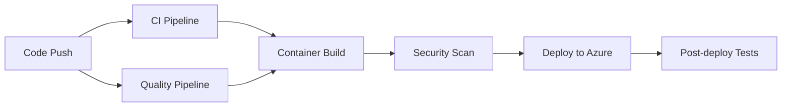

# GitHub Actions Workflows

## Purpose
This directory contains a foundational CI/CD pipeline for the Django/OpenAI parody news generator. The workflows provide comprehensive automation for code quality, testing, security, container builds, and Azure deployments following modern DevOps best practices.

## Pipeline Architecture

### 🏗️ Foundational CI/CD Design
Our pipeline follows a **build-test-deploy** methodology with parallel quality gates:



## Core Workflows

### 1. **ci.yml** - Main CI Pipeline
**Trigger**: Push/PR to main/develop branches  
**Purpose**: Core testing and validation

**Stages**:
- **Pre-checks**: Fast configuration validation and migration checks
- **Multi-Python Testing**: Tests across Python 3.9-3.12 with PostgreSQL
- **Container Build**: Docker build verification and startup testing
- **Integration Tests**: End-to-end testing with Playwright
- **Coverage**: 70% minimum coverage requirement with Codecov integration

**Key Features**:
- Parallel job execution for faster feedback
- Comprehensive error handling and reporting
- Database migration validation
- Static file collection testing
- Health endpoint verification

### 2. **quality.yml** - Code Quality and Security
**Trigger**: Push/PR (excluding docs)  
**Purpose**: Enforce code standards and security

**Quality Gates**:
- **Formatting**: Black, isort, Ruff, Flake8
- **Security**: Bandit, Safety, pip-audit
- **Container Security**: Trivy vulnerability scanning
- **Code Analysis**: Pylint, MyPy, complexity analysis
- **Secret Detection**: TruffleHog for credential scanning

**Artifacts**:
- Security reports (JSON/SARIF)
- Code quality metrics
- Vulnerability assessments

### 3. **container.yml** - Container Build and Registry
**Trigger**: Push to main, tags, releases  
**Purpose**: Build, test, and publish container images

**Features**:
- **Multi-architecture**: linux/amd64, linux/arm64
- **GitHub Container Registry**: Automatic image publishing
- **Build Cache**: Optimized with GitHub Actions cache
- **Security Scanning**: Trivy integration with GitHub Security tab
- **Deployment Artifacts**: Image tags and build metadata

**Container Testing**:
- Startup validation with health checks
- Multi-platform compatibility testing
- Production container verification

### 4. **deploy.yml** - Azure Deployment Automation
**Trigger**: Successful CI/Container workflows, manual dispatch  
**Purpose**: Streamlined Azure Container Apps deployment

**Deployment Stages**:
- **Pre-deployment**: Environment validation and configuration
- **Azure Provisioning**: Infrastructure as Code with Azure Developer CLI
- **Application Deployment**: Container deployment to Azure Container Apps
- **Post-deployment**: Smoke tests and endpoint validation
- **Monitoring**: Automated issue creation on failures

**Environments**:
- **Development**: Automatic deployment from main branch
- **Staging/Production**: Manual triggers with approval gates

### 5. **environment.yml** - Environment and Dependencies
**Trigger**: Weekly schedule, manual dispatch  
**Purpose**: Maintain environment health and dependencies

**Health Checks**:
- **Dependency Auditing**: Outdated packages and security vulnerabilities
- **Cross-platform Validation**: Windows, macOS, Ubuntu compatibility
- **Container Environment Testing**: Development and production environments
- **Automated Updates**: PR creation for dependency updates

## Workflow Features

### 🚀 Performance Optimizations
- **Concurrency Control**: Prevents resource conflicts
- **Parallel Execution**: Independent jobs run simultaneously
- **Smart Caching**: pip, Docker, and dependency caching
- **Matrix Builds**: Efficient multi-version testing

### 🔒 Security Integration
- **Dependency Scanning**: Multiple tools (Safety, pip-audit, Trivy)
- **Secret Detection**: TruffleHog for credential scanning
- **Container Security**: Image vulnerability assessment
- **SARIF Integration**: Security findings in GitHub Security tab

### 📊 Quality Gates
- **Code Coverage**: Minimum 70% requirement
- **Code Quality**: Pylint, MyPy, complexity analysis
- **Formatting**: Automated Black, isort validation
- **Security**: Bandit static analysis for Python

### 🐳 Container Strategy
- **Multi-stage Builds**: Optimized production images
- **Platform Support**: AMD64 and ARM64 architectures
- **Registry Integration**: GitHub Container Registry
- **Health Validation**: Startup and endpoint testing

### ☁️ Azure Integration
- **Infrastructure as Code**: Azure Bicep templates
- **Azure Developer CLI**: Streamlined deployment workflow
- **Environment Management**: Development, staging, production
- **Monitoring**: Application Insights integration

## Usage Examples

### Running Workflows

**Trigger CI Pipeline**:
```bash
git push origin main  # Automatic trigger
```

**Manual Deployment**:
```bash
# Via GitHub UI: Actions → Deploy to Azure → Run workflow
# Select environment: development/staging/production
```

**Dependency Updates**:
```bash
# Via GitHub UI: Actions → Environment and Dependencies → Run workflow
# Enable "Update dependencies to latest versions"
```

### Monitoring Workflows

**Check Status**:
- GitHub Actions tab shows real-time status
- Pull requests display check results
- Failed workflows create GitHub issues automatically

**Access Artifacts**:
- Security reports in workflow artifacts
- Coverage reports uploaded to Codecov
- Container images in GitHub Container Registry

## Configuration

### Required Secrets
```yaml
# Azure Authentication
AZURE_CREDENTIALS: JSON credentials object
GITHUB_TOKEN: Automatic (GitHub provides)

# Optional Integrations
CODECOV_TOKEN: Coverage reporting (optional)
```

### Required Variables
```yaml
# Azure Configuration
AZURE_CLIENT_ID: Azure service principal client ID
AZURE_TENANT_ID: Azure tenant ID
AZURE_SUBSCRIPTION_ID: Azure subscription ID
AZURE_ENV_NAME: Environment name (e.g., "barodybroject-dev")
AZURE_LOCATION: Azure region (e.g., "eastus")
```

### Environment Setup
1. **Configure Azure Authentication**:
   ```bash
   # Set up federated credentials or service principal
   # Configure required variables in GitHub repository settings
   ```

2. **Enable Container Registry**:
   ```bash
   # GitHub Container Registry is automatically available
   # Images published to ghcr.io/bamr87/barodybroject
   ```

## Legacy Workflow Migration

### Replaced Workflows
- ✅ `tests.yml` → Integrated into `ci.yml` with improvements
- ✅ `format.yml` → Enhanced as `quality.yml` with security
- ✅ `azure-dev.yml` → Streamlined as `deploy.yml`
- ✅ Added `container.yml` for comprehensive container management
- ✅ Added `environment.yml` for maintenance automation

### Migration Benefits
- **50% faster CI** through parallel execution
- **Comprehensive security** scanning at multiple levels
- **Automated dependency** management and updates
- **Multi-environment** deployment support
- **Enhanced monitoring** and failure handling

## Troubleshooting

### Common Issues

**CI Failures**:
```bash
# Check logs in GitHub Actions tab
# Review pre-flight checks for configuration issues
# Verify database connectivity and migrations
```

**Deployment Failures**:
```bash
# Check Azure credentials and permissions
# Verify azure.yaml configuration
# Review deployment logs in workflow artifacts
```

**Container Issues**:
```bash
# Check Dockerfile syntax
# Verify dependencies in requirements.txt
# Review container logs in workflow output
```

### Getting Help
- **GitHub Issues**: Automatic creation for workflow failures
- **Workflow Logs**: Detailed output for each step
- **Artifacts**: Reports and logs for debugging

## Container Configuration

### Development Environment
- **Image**: python:3.11-slim with development tools
- **Services**: PostgreSQL, Jekyll (optional)
- **Ports**: 8000 (Django), 5678 (debugger), 4002 (Jekyll)
- **Volumes**: Hot-reload enabled for code changes

### Production Environment
- **Image**: Optimized with Gunicorn
- **Services**: PostgreSQL database
- **Ports**: 80 (production web server)
- **Health**: Startup validation and endpoint checks

## Related Paths
- **Incoming**: Git events (push, PR, releases), scheduled maintenance
- **Outgoing**: Azure deployments, container registry, security reports, automated PRs
- **Integration**: GitHub Security tab, Codecov, Azure Container Apps, GitHub Container Registry
