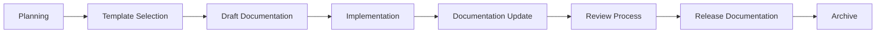

# Changelog Documentation System

This directory contains the comprehensive changelog documentation for the Barodybroject Django application. This system provides structured change tracking, standardized documentation, and clear historical records for all project modifications.

## 📂 Directory Structure

```
docs/changelog/
├── README.md                    # This file - overview and guidelines
├── templates/                   # Standardized templates for different change types
│   ├── feature-template.md      # New feature documentation template
│   ├── bugfix-template.md       # Bug fix documentation template
│   ├── improvement-template.md  # Enhancement/improvement template
│   ├── security-template.md     # Security update template
│   └── breaking-template.md     # Breaking change template
├── releases/                    # Release-specific changelogs
│   ├── v0.3.0/                 # Template Modernization Release
│   ├── v0.2.0/                 # Framework Simplification Release
│   └── v0.1.0/                 # Initial Release
├── summaries/                   # Comprehensive change summaries
│   ├── 2025-01-27-template-improvements/
│   ├── 2025-01-26-framework-simplification/
│   └── 2025-01-25-docker-optimization/
├── archive/                     # Historical documentation (migrated from root)
│   ├── CHANGELOG_SUMMARY.md    # Original comprehensive summary
│   ├── TEMPLATE_IMPROVEMENTS.md
│   ├── FRAMEWORK_SIMPLIFICATION_SUMMARY.md
│   └── DOCKER_SIMPLIFICATION_SUMMARY.md
├── CHANGELOG.md                 # Main project changelog (Keep a Changelog format)
└── CONTRIBUTING_CHANGES.md     # Guidelines for contributing changes
```

## 🎯 Purpose and Benefits

### **Organized Change Tracking**
- Clear separation between different types of changes
- Consistent documentation format across all modifications
- Easy navigation and discovery of specific changes
- Comprehensive historical record

### **Developer Experience**
- Standardized templates reduce documentation effort
- Clear guidelines for contributing changes
- Consistent format makes reviewing changes easier
- Integration with development workflow

### **Project Management**
- Release planning and version management
- Impact assessment for breaking changes
- Timeline tracking for feature development
- Knowledge preservation for team members

### **Community and Open Source**
- Transparent communication of changes
- Professional documentation standards
- Easy for contributors to understand project evolution
- Compliance with open source best practices

## 📋 Change Categories

### **Features** 🚀
New functionality, capabilities, or enhancements that add value to users.
- New API endpoints
- User interface improvements
- Integration with external services
- New command-line tools or scripts

### **Bug Fixes** 🐛
Corrections to existing functionality that was not working as intended.
- Error resolution
- Performance fixes
- Compatibility issues
- Edge case handling

### **Improvements** ⚡
Enhancements to existing functionality without adding new features.
- Performance optimizations
- Code refactoring
- Documentation improvements
- Development workflow enhancements

### **Security** 🔒
Security-related updates and vulnerability fixes.
- Dependency security updates
- Authentication improvements
- Input validation enhancements
- Access control modifications

### **Breaking Changes** ⚠️
Modifications that require user action or may break existing functionality.
- API changes
- Configuration format changes
- Dependency requirement changes
- Database schema modifications

## 🔄 Workflow Integration

### **Development Process**
1. **Change Planning**: Use templates to document planned changes
2. **Implementation**: Update relevant documentation during development
3. **Review**: Include documentation review in pull request process
4. **Release**: Consolidate changes into release documentation
5. **Archive**: Move completed change documentation to appropriate archive

### **Documentation Lifecycle**


### **Version Management**
- **Major Releases**: Breaking changes, significant new features
- **Minor Releases**: New features, improvements, non-breaking changes
- **Patch Releases**: Bug fixes, security updates, minor improvements

## 📝 Documentation Standards

### **Format Requirements**
- All documentation in Markdown format
- Consistent heading structure (H1 for title, H2 for sections)
- Use of tables for structured data
- Code blocks with proper syntax highlighting
- Links to related issues, pull requests, and documentation

### **Content Requirements**
- Clear, concise descriptions of changes
- Impact assessment for users and developers
- Migration guides for breaking changes
- Before/after comparisons where applicable
- Testing information and validation steps

### **Metadata Standards**
```yaml
---
title: "Change Title"
type: "feature|bugfix|improvement|security|breaking"
version: "X.Y.Z"
date: "YYYY-MM-DD"
author: "Author Name"
reviewers: ["Reviewer 1", "Reviewer 2"]
related_issues: ["#123", "#456"]
related_prs: ["#789", "#012"]
impact: "high|medium|low"
breaking: true|false
---
```

## 🚀 Getting Started

### **For Contributors**
1. Review [CONTRIBUTING_CHANGES.md](./CONTRIBUTING_CHANGES.md) for detailed guidelines
2. Select appropriate template from `templates/` directory
3. Follow the template structure for your change type
4. Include all required metadata and documentation
5. Submit documentation with your code changes

### **For Maintainers**
1. Ensure all changes include proper documentation
2. Review documentation as part of code review process
3. Consolidate changes into release documentation
4. Update main CHANGELOG.md with each release
5. Archive completed documentation appropriately

### **For Users**
1. Check [CHANGELOG.md](./CHANGELOG.md) for latest changes
2. Review release documentation in `releases/` for detailed information
3. Check breaking change documentation before updating
4. Refer to migration guides for version updates

## 🔧 Tools and Automation

### **Recommended Tools**
- **markdownlint**: Ensure consistent Markdown formatting
- **github-changelog-generator**: Automate changelog generation
- **semantic-release**: Automated version management
- **pre-commit**: Validate documentation before commits

### **Automation Opportunities**
- Automatic changelog generation from commit messages
- Template validation in CI/CD pipeline
- Link checking for documentation references
- Automated archiving of completed changes

## 📊 Metrics and Monitoring

### **Documentation Health**
- Completeness of change documentation
- Consistency with documentation standards
- Timeliness of documentation updates
- Community engagement with changelog

### **Process Effectiveness**
- Time from change to documentation
- Number of documentation-related issues
- Contributor adoption of templates
- User feedback on change clarity

## 🔗 Related Resources

- [Main Project README](../../README.md)
- [Contributing Guidelines](../../CONTRIBUTING.md)
- [Development Documentation](../development/)
- [API Documentation](../api/)
- [Deployment Documentation](../deployment/)

---

**Last Updated**: January 27, 2025  
**Version**: 1.0.0  
**Maintainer**: Barodybroject Team

For questions about the changelog system, please open an issue or contact the maintainers.