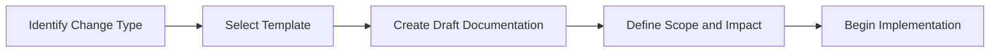
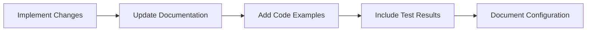
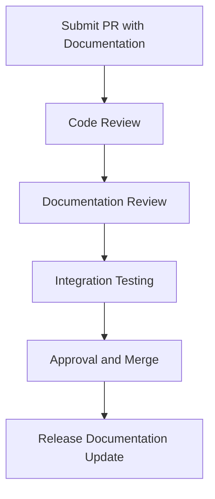

# Contributing Changes Documentation

This guide provides detailed instructions for contributing changes and maintaining documentation in the Barodybroject changelog system.

## 📋 Table of Contents

- [Quick Start](#quick-start)
- [Change Documentation Workflow](#change-documentation-workflow)
- [Template Selection Guide](#template-selection-guide)
- [Documentation Standards](#documentation-standards)
- [Review Process](#review-process)
- [Release Management](#release-management)
- [Tools and Automation](#tools-and-automation)

## 🚀 Quick Start

### For New Contributors

1. **Select Template**: Choose from `docs/changelog/templates/`
2. **Copy Template**: Create your documentation file
3. **Follow Format**: Use the template structure
4. **Submit with Code**: Include documentation in your PR

### For Maintainers

1. **Review Documentation**: Ensure completeness and accuracy
2. **Consolidate Changes**: Group related changes for releases
3. **Update Main Changelog**: Add entries to `CHANGELOG.md`
4. **Archive Documentation**: Move completed docs to appropriate locations

## 🔄 Change Documentation Workflow

### Phase 1: Planning and Design

#### Before Starting Development


**Steps:**
1. **Identify Change Type**: Feature, bugfix, improvement, security, breaking change
2. **Select Template**: Use appropriate template from `docs/changelog/templates/`
3. **Create Documentation Draft**: Fill in known information
4. **Define Scope**: Clearly outline what will change
5. **Impact Assessment**: Determine user and system impact

#### Documentation Draft Example
```yaml
---
title: "[Feature] AI-Powered Content Suggestions"
type: "feature"
version: "0.4.0"
date: "2025-01-28"
author: "Developer Name <dev@example.com>"
impact: "medium"
breaking: false
---

# Feature: AI-Powered Content Suggestions

> **Summary**: Add AI-powered content suggestions to help users write better articles.

## 🎯 Overview

### Purpose
Help users improve their writing with AI-generated suggestions for content enhancement.

[Continue with template structure...]
```

### Phase 2: Implementation and Documentation

#### During Development


**Continuous Documentation Updates:**
- Update technical implementation details
- Add code examples and usage patterns
- Document configuration changes
- Include test results and validation
- Note any discovered issues or limitations

#### Best Practices During Implementation
- **Keep Documentation Current**: Update as implementation evolves
- **Include Real Examples**: Use actual code snippets and configurations
- **Document Edge Cases**: Note special conditions or limitations
- **Track Dependencies**: Record new dependencies or version requirements
- **Test Documentation**: Ensure code examples actually work

### Phase 3: Review and Integration

#### Pull Request Review Process


**Review Checklist:**
- [ ] Documentation template properly followed
- [ ] All sections completed with relevant information
- [ ] Code examples tested and working
- [ ] Impact assessment accurate
- [ ] Migration guides included (if needed)
- [ ] Related issues and PRs linked

### Phase 4: Release and Archive

#### Release Process
1. **Consolidate Changes**: Group related changes for version release
2. **Update Main Changelog**: Add entries to `docs/changelog/CHANGELOG.md`
3. **Create Release Documentation**: Comprehensive release notes
4. **Archive Individual Changes**: Move to appropriate archive locations
5. **Update Cross-References**: Ensure links remain valid

## 📝 Template Selection Guide

### Feature Template (`feature-template.md`)
**Use When:**
- Adding new functionality
- Creating new API endpoints
- Implementing user-facing features
- Adding integrations or capabilities

**Examples:**
- New authentication system
- AI-powered content generation
- Real-time notifications
- API versioning

### Bug Fix Template (`bugfix-template.md`)
**Use When:**
- Fixing broken functionality
- Resolving errors or exceptions
- Correcting data consistency issues
- Addressing performance problems

**Examples:**
- Authentication failures
- Database connection issues
- UI rendering problems
- Memory leaks

### Improvement Template (`improvement-template.md`)
**Use When:**
- Enhancing existing functionality
- Optimizing performance
- Refactoring code
- Improving user experience

**Examples:**
- Performance optimizations
- Code refactoring
- UI/UX enhancements
- Development workflow improvements

### Security Template (`security-template.md`)
**Use When:**
- Fixing security vulnerabilities
- Implementing security enhancements
- Updating dependencies for security
- Adding security features

**Examples:**
- SQL injection fixes
- Authentication improvements
- Dependency security updates
- Access control enhancements

### Breaking Change Template (`breaking-template.md`)
**Use When:**
- Making incompatible API changes
- Removing features or endpoints
- Changing configuration requirements
- Modifying database schemas

**Examples:**
- API version upgrades
- Configuration format changes
- Database migrations
- Dependency requirement changes

## 📊 Documentation Standards

### Metadata Requirements

All change documentation must include proper frontmatter:

```yaml
---
title: "Clear, descriptive title"
type: "feature|bugfix|improvement|security|breaking"
version: "X.Y.Z"
date: "YYYY-MM-DD"
author: "Full Name <email@domain.com>"
reviewers: ["Reviewer 1", "Reviewer 2"]
related_issues: ["#123", "#456"]
related_prs: ["#789", "#012"]
impact: "critical|high|medium|low"
breaking: true|false
---
```

### Content Standards

#### Writing Style
- **Clear and Concise**: Use simple, direct language
- **Technical Accuracy**: Ensure all technical details are correct
- **User-Focused**: Write from the user's perspective
- **Complete Information**: Include all necessary details
- **Professional Tone**: Maintain consistent, professional language

#### Code Examples
```python
# Always include working code examples
def example_function(parameter):
    """
    Clear docstring explaining the function.
    
    Args:
        parameter: Description of the parameter
    
    Returns:
        Description of what is returned
    """
    return process_parameter(parameter)
```

#### Screenshots and Diagrams
- Include screenshots for UI changes
- Create diagrams for architectural changes
- Use consistent styling and formatting
- Optimize images for web viewing
- Include alt text for accessibility

### Link and Reference Standards

#### Internal Links
```markdown
[Configuration Guide](../configuration/settings.md)
[API Documentation](../api/v2/endpoints.md)
[Troubleshooting](../troubleshooting/common-issues.md)
```

#### External Links
```markdown
[Django Documentation](https://docs.djangoproject.com/)
[Bootstrap Components](https://getbootstrap.com/docs/5.3/components/)
[Security Best Practices](https://owasp.org/www-project-top-ten/)
```

#### Issue and PR References
```markdown
- Feature Request: #123
- Implementation: #456
- Bug Report: #789
- Related Discussion: #012
```

## 👥 Review Process

### Documentation Review Checklist

#### Content Review
- [ ] **Completeness**: All template sections filled appropriately
- [ ] **Accuracy**: Technical details are correct and verified
- [ ] **Clarity**: Information is easy to understand
- [ ] **Relevance**: Content is focused and relevant
- [ ] **Consistency**: Follows established style and format

#### Technical Review
- [ ] **Code Examples**: All code snippets tested and working
- [ ] **Configuration**: Settings and environment variables correct
- [ ] **Dependencies**: Version requirements accurate
- [ ] **Migration Steps**: Migration procedures tested
- [ ] **Breaking Changes**: Impact properly assessed and documented

#### Process Review
- [ ] **Template Usage**: Appropriate template selected and followed
- [ ] **Metadata**: Frontmatter complete and accurate
- [ ] **Links**: All references valid and working
- [ ] **Integration**: Fits with existing documentation structure
- [ ] **Timeline**: Documentation timing aligns with implementation

### Review Roles and Responsibilities

#### Author Responsibilities
- Complete all required sections of chosen template
- Test all code examples and procedures
- Link to related issues and pull requests
- Respond to reviewer feedback promptly
- Update documentation based on review comments

#### Reviewer Responsibilities
- Review for technical accuracy and completeness
- Verify code examples and migration procedures
- Check for consistency with project standards
- Provide constructive feedback for improvements
- Approve only when documentation meets quality standards

#### Maintainer Responsibilities
- Ensure documentation review is part of PR process
- Consolidate individual changes into release documentation
- Update main changelog with appropriate entries
- Archive completed documentation appropriately
- Maintain documentation structure and organization

## 📦 Release Management

### Release Documentation Process

#### Pre-Release
1. **Collect Changes**: Gather all change documentation for release
2. **Create Release Directory**: `docs/changelog/releases/vX.Y.Z/`
3. **Consolidate Documentation**: Create comprehensive release notes
4. **Update Main Changelog**: Add release entry to `CHANGELOG.md`
5. **Review and Approve**: Final review of all release documentation

#### Release Documentation Structure
```
releases/v0.4.0/
├── README.md                 # Release overview
├── FEATURES.md              # New features summary
├── BREAKING_CHANGES.md      # Breaking changes and migration
├── BUG_FIXES.md            # Bug fixes summary
├── MIGRATION_GUIDE.md       # Detailed migration instructions
└── KNOWN_ISSUES.md         # Known issues and limitations
```

#### Post-Release
1. **Archive Individual Changes**: Move change docs to summaries archive
2. **Update Cross-References**: Ensure all links remain valid
3. **Create Release Summary**: High-level summary for stakeholders
4. **Community Communication**: Announce release with documentation
5. **Monitor Feedback**: Collect and address documentation feedback

### Version Management

#### Semantic Versioning
- **MAJOR** (X.0.0): Breaking changes, incompatible API changes
- **MINOR** (0.X.0): New features, backward-compatible additions
- **PATCH** (0.0.X): Bug fixes, backward-compatible fixes

#### Documentation Versioning
- Each release gets dedicated documentation directory
- Historical documentation preserved in archive
- Main changelog maintains chronological history
- Cross-references updated for version changes

## 🔧 Tools and Automation

### Recommended Tools

#### Markdown Tools
```bash
# Install markdownlint for consistency
npm install -g markdownlint-cli

# Lint documentation
markdownlint docs/changelog/**/*.md

# Fix common issues automatically
markdownlint --fix docs/changelog/**/*.md
```

#### Link Validation
```bash
# Install markdown-link-check
npm install -g markdown-link-check

# Check all documentation links
find docs/changelog -name "*.md" -exec markdown-link-check {} \;
```

#### Spell Checking
```bash
# Install cspell
npm install -g cspell

# Check spelling in documentation
cspell docs/changelog/**/*.md
```

### GitHub Integration

#### Pre-commit Hooks
```yaml
# .pre-commit-config.yaml
repos:
  - repo: https://github.com/pre-commit/pre-commit-hooks
    rev: v4.4.0
    hooks:
      - id: check-markdown
      - id: check-yaml
      - id: trailing-whitespace

  - repo: https://github.com/igorshubovych/markdownlint-cli
    rev: v0.37.0
    hooks:
      - id: markdownlint
        args: ['--fix']
```

#### GitHub Actions
```yaml
# .github/workflows/documentation.yml
name: Documentation Quality Check
on: [push, pull_request]

jobs:
  docs-check:
    runs-on: ubuntu-latest
    steps:
      - uses: actions/checkout@v3
      - name: Lint Markdown
        run: markdownlint docs/changelog/**/*.md
      - name: Check Links
        run: |
          npm install -g markdown-link-check
          find docs/changelog -name "*.md" -exec markdown-link-check {} \;
      - name: Spell Check
        run: |
          npm install -g cspell
          cspell docs/changelog/**/*.md
```

### Automation Opportunities

#### Template Validation
- Validate that required frontmatter fields are present
- Check that appropriate template structure is followed
- Ensure code examples have proper syntax highlighting
- Verify that impact assessment is included

#### Cross-Reference Management
- Automatically update links when files are moved
- Validate internal references during build
- Generate cross-reference indexes
- Update related documentation when changes occur

#### Release Automation
- Auto-generate release notes from individual changes
- Create release directories automatically
- Update main changelog from structured data
- Archive completed documentation after releases

## 📞 Support and Questions

### Getting Help
- **Documentation Issues**: Open issue with `documentation` label
- **Template Questions**: Ask in `#documentation` Slack channel
- **Process Clarification**: Contact documentation maintainers
- **Tool Problems**: Check tool documentation or open support issue

### Contributing to This Guide
This contribution guide is itself documentation that can be improved:

1. **Identify Improvements**: Unclear processes or missing information
2. **Propose Changes**: Open issue or submit PR with improvements
3. **Follow Process**: Use improvement template for documentation changes
4. **Get Review**: Have changes reviewed by documentation team
5. **Update Process**: Incorporate approved changes

---

## ✅ Quick Reference Checklist

### Before Starting Work
- [ ] Change type identified (feature/bugfix/improvement/security/breaking)
- [ ] Appropriate template selected from `docs/changelog/templates/`
- [ ] Documentation draft created with known information
- [ ] Scope and impact assessed

### During Development
- [ ] Documentation updated as implementation progresses
- [ ] Code examples tested and working
- [ ] Configuration changes documented
- [ ] Edge cases and limitations noted

### Before Submitting PR
- [ ] All template sections completed
- [ ] Frontmatter metadata accurate and complete
- [ ] Links to related issues and PRs included
- [ ] Migration guides written (if applicable)
- [ ] Impact assessment finalized

### During Review
- [ ] Respond to reviewer feedback promptly
- [ ] Update documentation based on comments
- [ ] Verify all links and examples still work
- [ ] Ensure consistency with project standards

### After Merge
- [ ] Monitor for documentation-related issues
- [ ] Update cross-references if needed
- [ ] Participate in release documentation consolidation
- [ ] Archive individual change documentation appropriately

---

**Last Updated**: January 27, 2025  
**Version**: 1.0.0  
**Maintainer**: Barodybroject Documentation Team

For questions about this process, please contact the documentation maintainers or open an issue with the `documentation` label.