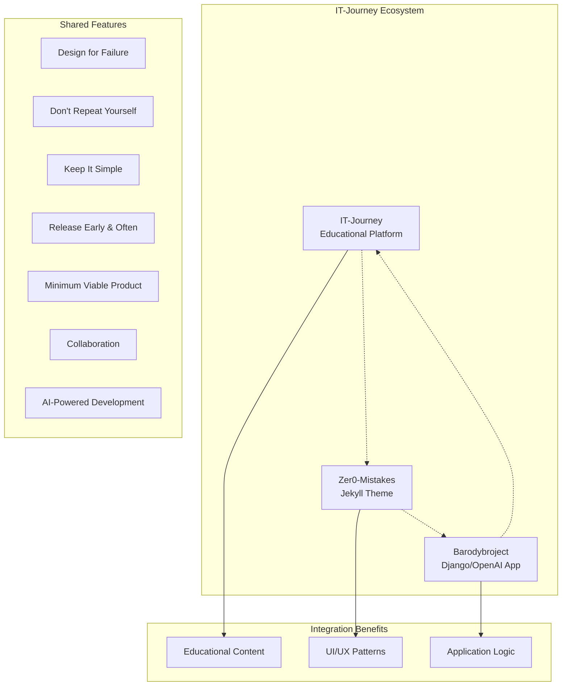

# Ecosystem Integration Features

**Cross-Repository Integration and Harmonization Standards**

## 🌐 Feature Overview

The Ecosystem Integration feature provides seamless integration between Barodybroject and the broader IT-Journey ecosystem, enabling shared development patterns, consistent documentation standards, and cross-repository collaboration.

### Core Integration Components



## 🔄 Cross-Repository Learning Patterns

### Educational Excellence Integration
**IT-Journey → Barodybroject**

Transform Django/OpenAI development into structured learning experiences:

```yaml
# Example educational pattern integration
django_feature:
  title: "Forging the OpenAI Service Crystal: Django Integration Quest"
  difficulty: "🟡 Intermediate"
  learning_outcomes:
    - "🎯 Master Django service layer architecture"
    - "⚡ Implement robust OpenAI API integration"
    - "🛠️ Build production-ready AI-powered features"
  
  implementation_features:
    service_layer: "OpenAI service integration with retry logic"
    error_handling: "Comprehensive exception handling patterns"
    testing_strategy: "AI service testing with mocks and fixtures"
```

### Production-Ready Patterns
**Barodybroject → IT-Journey**

Apply Django production patterns to educational content:

- **Container-First Development**: Docker patterns for educational content delivery
- **API Integration Patterns**: Django REST Framework patterns for educational APIs
- **Error Handling Excellence**: Production error handling for educational systems
- **Testing Strategies**: Comprehensive testing approaches for validation

### Theme and UI Excellence
**Zer0-Mistakes → Both Repositories**

Consistent UI patterns across all repositories:

- **Bootstrap Integration**: Unified UI components and styling
- **Jekyll Optimization**: Static content generation patterns
- **Responsive Design**: Mobile-first design implementation
- **Performance Optimization**: Theme optimization across platforms

## 🛠️ Development Workflow Features

### README-First, README-Last Implementation

Automated documentation maintenance workflow:

```python
# Django management command for README updates
class Command(BaseCommand):
    help = 'Update README files with current feature status'
    
    def handle(self, *args, **options):
        # Before development: Review README context
        self.review_readme_context()
        
        # After development: Update README content
        self.update_readme_content()
        
        # Cross-repository: Check integration impact
        self.check_cross_repo_impact()
```

### Container-First Development Features

Docker integration across development workflow:

```yaml
# Development environment configuration
version: '3.8'
services:
  web:
    build:
      context: .
      dockerfile: Dockerfile
    environment:
      - ECOSYSTEM_INTEGRATION=enabled
      - COPILOT_OPTIMIZATION=true
    volumes:
      - ./src:/app/src:rw
      - ./docs:/app/docs:rw
```

### AI-Powered Development Integration

VS Code Copilot optimization features:

```python
# AI-assisted code generation patterns
class EcosystemService:
    """
    Service for cross-repository integration patterns
    
    This service implements ecosystem-wide standards for:
    - VS Code Copilot optimization
    - Cross-repository pattern sharing
    - Documentation harmonization
    """
    
    def generate_copilot_context(self, component_type: str) -> dict:
        """Generate context for VS Code Copilot assistance"""
        return {
            'repository_context': 'Barodybroject Django/OpenAI application',
            'ecosystem_integration': True,
            'shared_principles': ['DFF', 'DRY', 'KIS', 'REnO', 'MVP', 'COLAB', 'AIPD'],
            'component_type': component_type
        }
```

## 📋 Configuration Features

### Unified Development Standards

Shared configuration patterns across repositories:

```python
# Django settings for ecosystem integration
ECOSYSTEM_INTEGRATION = {
    'REPOSITORIES': {
        'it_journey': {
            'url': 'https://github.com/bamr87/it-journey',
            'integration_type': 'educational_content'
        },
        'zer0_mistakes': {
            'url': 'https://github.com/bamr87/zer0-mistakes',
            'integration_type': 'theme_patterns'
        }
    },
    'SHARED_STANDARDS': {
        'frontmatter_structure': True,
        'copilot_optimization': True,
        'container_first': True,
        'readme_maintenance': True
    }
}
```

### Repository-Specific Adaptations

Django-specific ecosystem configuration:

```yaml
# Django ecosystem adaptations
django_context:
  mvt_architecture: "Follow Django Model-View-Template patterns"
  service_layer: "Implement business logic in service classes"
  api_development: "Use Django REST Framework for API endpoints"

openai_integration:
  error_handling: "Implement comprehensive retry logic and error handling"
  caching_strategies: "Cache expensive AI operations appropriately"
  security_patterns: "Secure API key management and validation"

deployment_context:
  container_optimization: "Optimize for Azure Container Apps deployment"
  infrastructure_code: "Use Azure Bicep for infrastructure management"
  ci_cd_automation: "Implement comprehensive GitHub Actions workflows"
```

## 🔗 Integration Opportunities

### Cross-Repository Feature Sharing

#### Educational Content Integration
- Django/OpenAI development quests and tutorials
- Production pattern documentation for educational content
- AI integration examples for learning platforms

#### Technical Pattern Sharing
- Django best practices across educational content
- Container-first development patterns
- OpenAI integration patterns for educational AI features

#### UI/UX Consistency
- Bootstrap standards across all web interfaces
- Mobile-first design patterns for all platforms
- Universal design principles across repositories

### Collaborative Development Features

#### Shared Component Architecture
```python
# Example shared component pattern
class SharedAuthenticationMixin:
    """
    Authentication patterns shared across ecosystem
    
    Implements Django authentication patterns that can be
    adapted for educational platforms and theme integration
    """
    
    def get_ecosystem_context(self):
        return {
            'shared_auth_patterns': True,
            'cross_repo_integration': True,
            'educational_friendly': True
        }
```

## 📈 Maintenance and Evolution Features

### Automated Harmonization

Validation and synchronization tools:

```python
# Django management command for ecosystem validation
class Command(BaseCommand):
    help = 'Validate ecosystem integration consistency'
    
    def handle(self, *args, **options):
        validator = EcosystemValidator()
        
        # Check frontmatter consistency
        frontmatter_status = validator.check_frontmatter_consistency()
        
        # Validate cross-references
        cross_ref_status = validator.validate_cross_references()
        
        # Ensure version alignment
        version_status = validator.check_version_alignment()
        
        # Report inconsistencies
        validator.generate_report([
            frontmatter_status,
            cross_ref_status,
            version_status
        ])
```

### Synchronization Features

```bash
# Automated synchronization scripts
#!/bin/bash
# Synchronize shared standards across repositories

echo "🔄 Synchronizing ecosystem standards..."

# Update common frontmatter patterns
python manage.py sync_frontmatter_patterns

# Sync VS Code Copilot optimization patterns
python manage.py sync_copilot_patterns

# Align container development standards
python manage.py sync_container_standards

# Update cross-repository references
python manage.py update_cross_references

echo "✅ Ecosystem synchronization complete"
```

## 🎯 Success Metrics and Monitoring

### Integration Health Dashboard

```python
# Django view for ecosystem integration monitoring
class EcosystemDashboardView(TemplateView):
    template_name = 'ecosystem/dashboard.html'
    
    def get_context_data(self, **kwargs):
        context = super().get_context_data(**kwargs)
        
        # Consistency metrics
        context['consistency_metrics'] = {
            'frontmatter_compliance': self.check_frontmatter_compliance(),
            'copilot_optimization': self.check_copilot_optimization(),
            'cross_repo_references': self.check_cross_references(),
            'container_standards': self.check_container_standards()
        }
        
        # Quality metrics
        context['quality_metrics'] = {
            'documentation_freshness': self.check_doc_freshness(),
            'community_feedback': self.get_community_feedback(),
            'best_practice_adoption': self.check_best_practices(),
            'integration_coverage': self.check_integration_coverage()
        }
        
        return context
```

### Automated Health Checks

```python
# Health check for ecosystem integration
class EcosystemHealthCheck:
    def run_checks(self):
        return {
            'unified_frontmatter': self.check_unified_frontmatter(),
            'copilot_patterns': self.check_copilot_patterns(),
            'cross_repo_links': self.check_cross_repo_links(),
            'container_alignment': self.check_container_alignment(),
            'documentation_sync': self.check_documentation_sync()
        }
```

## 🚀 Implementation Guide

### Setup Instructions

1. **Enable Ecosystem Integration**:
   ```python
   # In Django settings
   INSTALLED_APPS = [
       # ... other apps
       'ecosystem_integration',
   ]
   
   ECOSYSTEM_INTEGRATION_ENABLED = True
   ```

2. **Configure Cross-Repository Access**:
   ```bash
   # Environment variables
   export ECOSYSTEM_INTEGRATION=enabled
   export IT_JOURNEY_REPO_URL=https://github.com/bamr87/it-journey
   export ZER0_MISTAKES_REPO_URL=https://github.com/bamr87/zer0-mistakes
   ```

3. **Initialize Harmonization**:
   ```bash
   # Django management commands
   python manage.py initialize_ecosystem_integration
   python manage.py sync_instruction_files
   python manage.py validate_harmonization
   ```

### Usage Examples

#### Cross-Repository Content Creation
```python
# Create content with ecosystem integration
from ecosystem_integration.services import ContentService

content_service = ContentService()
educational_content = content_service.create_educational_content(
    title="Django OpenAI Integration Tutorial",
    target_repository="it-journey",
    content_type="quest",
    difficulty_level="intermediate"
)
```

#### VS Code Copilot Context Generation
```python
# Generate context for AI assistance
copilot_context = content_service.generate_copilot_context(
    component_type="django_service",
    integration_scope="ecosystem_wide"
)
```

---

*This ecosystem integration feature establishes seamless collaboration between Barodybroject and the broader IT-Journey ecosystem while maintaining Django application excellence and OpenAI integration capabilities.*